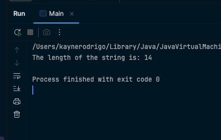
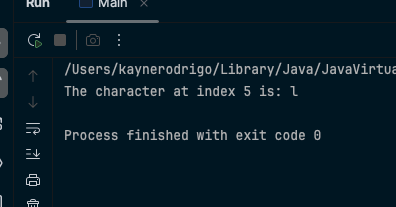
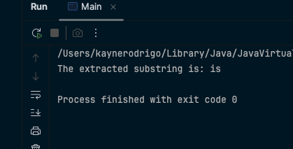
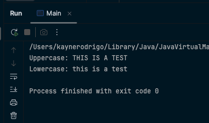
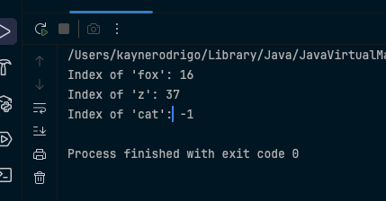
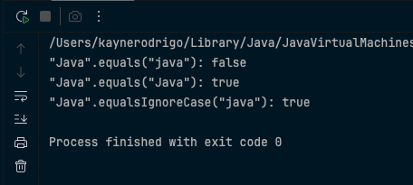
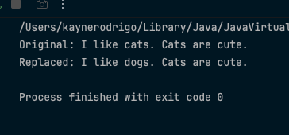
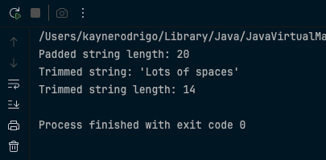

# JC-Exploring-Java-String-Methods

**Student Name:** Kayne Uriel Rodrigo
**Course:** Java Programming  
**Lab:** Exploring Java String Methods

## Overview

This repository contains the hands-on lab exercises for exploring essential methods of the Java String class. Each exercise involves prediction, observation, and explanation of String method behaviors.

## Exercises Completed

### Exercise 1: `length()` - Finding the String's Size
**Objective:** Understanding how to get the number of characters in a string

**Code:**
```java
public class StringLab {
    public static void main(String[] args) {
        String greeting = "Hello, Cadets!";
        int length = greeting.length();
        System.out.println("The length of the string is: " + length);
    }
}
```

**Output Screenshot:**


---

### Exercise 2: `charAt()` - Accessing a Character
**Objective:** Learning to access individual characters by index

**Code:**
```java
public class StringLab {
    public static void main(String[] args) {
        String message = "Keep learning!";
        char character = message.charAt(5);
        System.out.println("The character at index 5 is: " + character);
    }
}
```

**Output Screenshot:**


---

### Exercise 3: `substring()` - Extracting a Part of a String
**Objective:** Understanding how to extract portions of strings

**Code:**
```java
public class StringLab {
    public static void main(String[] args) {
        String statement = "Java is powerful.";
        String part = statement.substring(5, 7);
        System.out.println("The extracted substring is: " + part);
    }
}
```

**Output Screenshot:**


---

### Exercise 4: `toUpperCase()` and `toLowerCase()` - Changing Case
**Objective:** Learning case conversion methods

**Code:**
```java
public class StringLab {
    public static void main(String[] args) {
        String mixedCase = "This Is A Test";
        String upper = mixedCase.toUpperCase();
        String lower = mixedCase.toLowerCase();
        System.out.println("Uppercase: " + upper);
        System.out.println("Lowercase: " + lower);
    }
}
```

**Output Screenshot:**


---

### Exercise 5: `indexOf()` - Finding a Character or Substring
**Objective:** Learning to find the position of characters or substrings

**Code:**
```java
public class StringLab {
    public static void main(String[] args) {
        String sentence = "The quick brown fox jumps over the lazy dog";
        int indexOfFox = sentence.indexOf("fox");
        int indexOfZ = sentence.indexOf('z');
        int indexOfCat = sentence.indexOf("cat");
        System.out.println("Index of 'fox': " + indexOfFox);
        System.out.println("Index of 'z': " + indexOfZ);
        System.out.println("Index of 'cat': " + indexOfCat);
    }
}
```

**Output Screenshot:**


---

### Exercise 6: `equals()` vs. `equalsIgnoreCase()` - Comparing Strings
**Objective:** Understanding different string comparison methods

**Code:**
```java
public class StringLab {
    public static void main(String[] args) {
        String str1 = "Java";
        String str2 = "java";
        String str3 = "Java";
        boolean isEqual1 = str1.equals(str2);
        boolean isEqual2 = str1.equals(str3);
        boolean isEqualIgnoreCase = str1.equalsIgnoreCase(str2);
        System.out.println("\"Java\".equals(\"java\"): " + isEqual1);
        System.out.println("\"Java\".equals(\"Java\"): " + isEqual2);
        System.out.println("\"Java\".equalsIgnoreCase(\"java\"): " + isEqualIgnoreCase);
    }
}
```

**Output Screenshot:**


---

### Exercise 7: `replace()` - Replacing Characters
**Objective:** Learning to replace characters or substrings

**Code:**
```java
public class StringLab {
    public static void main(String[] args) {
        String original = "I like cats. Cats are cute.";
        String replaced = original.replace("cats", "dogs");
        System.out.println("Original: " + original);
        System.out.println("Replaced: " + replaced);
    }
}
```

**Output Screenshot:**


---

### Exercise 8: `trim()` - Removing Whitespace
**Objective:** Learning to remove leading and trailing whitespace

**Code:**
```java
public class StringLab {
    public static void main(String[] args) {
        String padded = "   Lots of spaces   ";
        String trimmed = padded.trim();
        System.out.println("Padded string length: " + padded.length());
        System.out.println("Trimmed string: '" + trimmed + "'");
        System.out.println("Trimmed string length: " + trimmed.length());
    }
}
```

**Output Screenshot:**


---

## Key Learning Points

- **String Immutability:** All String methods return new String objects rather than modifying the original
- **Zero-based Indexing:** String positions start at index 0
- **Case Sensitivity:** Methods like `equals()` are case-sensitive unless specifically designed otherwise
- **Return Values:** Different methods return different data types (int, char, String, boolean)

## Repository Structure

```
JC-Exploring-Java-String-Methods/
├── README.md
├── src/
│   └── StringLab.java
└── screenshots/
    ├── exercise1_output.png
    ├── exercise2_output.png
    ├── exercise3_output.png
    ├── exercise4_output.png
    ├── exercise5_output.png
    ├── exercise6_output.png
    ├── exercise7_output.png
    └── exercise8_output.png
```

## How to Run

1. Clone this repository
2. Navigate to the `src` directory
3. Compile: `javac StringLab.java`
4. Run: `java StringLab`

## Submission Notes

This lab demonstrates understanding of essential Java String methods through hands-on practice with prediction, observation, and explanation methodology.